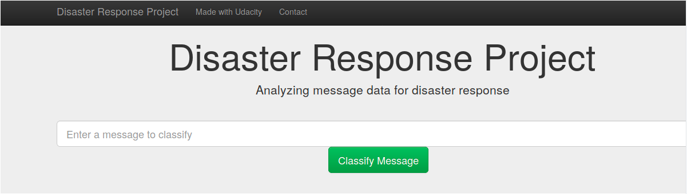

# Disaster Response Pipeline Project



## Table of Contents
1. [Description](#description)
2. [Project Components](#components)
3. [Installing](#install)
4. [Running](#run)
5. [Authors](#authors)
6. [Acknowledgement](#acknowledgement)

<a name ="description"></a>
## Description

This project is part of the Data Engineering module within the Data Science Nanodegree Program by Udacity in collaboration with Figure 8. The dataset contains pre-labelled messages from real-life disaster events. In response to a disaster, different organizations are responsible for different parts of the problem. For instance, one organization will care about water, the other about food, etc. In this project, the goal was to analyze disaster data from Figure Eight to build a model for an API that classifies disaster messages.

<a name = "components"></a>
## Project Components

1. ### ETL Pipeline

 - Loads the messages and categories datasets
 - Merges the two datasets
 - Cleans the data
 - Stores it in a SQLite database

2. ### ML Pipeline

 - Loads data from the SQLite database
 - Splits the dataset into training and test sets
 - Builds a text processing and machine learning pipeline
 - Trains and tunes a model using GridSearchCV
 - Outputs results on the test set
 - Exports the final model as a pickle file

3. ### Flask Web App

Visual dashboard to classify messages

<a name = "install"></a>
## Installing

To clone the git repository to your local computer, please type the following command on your terminal

```
git clone https://github.com/NIHALDSM10/Disaster_Pipeline_Project2_Udacity.git
```
<a name = "run"></a>
## Running

1. Run the following commands in the project's root directory to set up your database and model.

    - To run ETL pipeline that cleans data and stores in database
        `python data/process_data.py data/disaster_messages.csv data/disaster_categories.csv data/DisasterResponse.db`
    - To run ML pipeline that trains classifier and saves
        `python models/train_classifier.py data/DisasterResponse.db models/classifier.pkl`

2. Run the following command in the app's directory to run your web app.
    `python run.py`
    
3. Go to http://0.0.0.0:3001/

<a name = "authors"></a>
## Authors

[Nihal Shah](https://github.com/NIHALDSM10)

<a name = "acknowledgement"></a>
## Acknowledgement
[Udacity](https://www.udacity.com/)
[Figure Eight](https://appen.com/)


